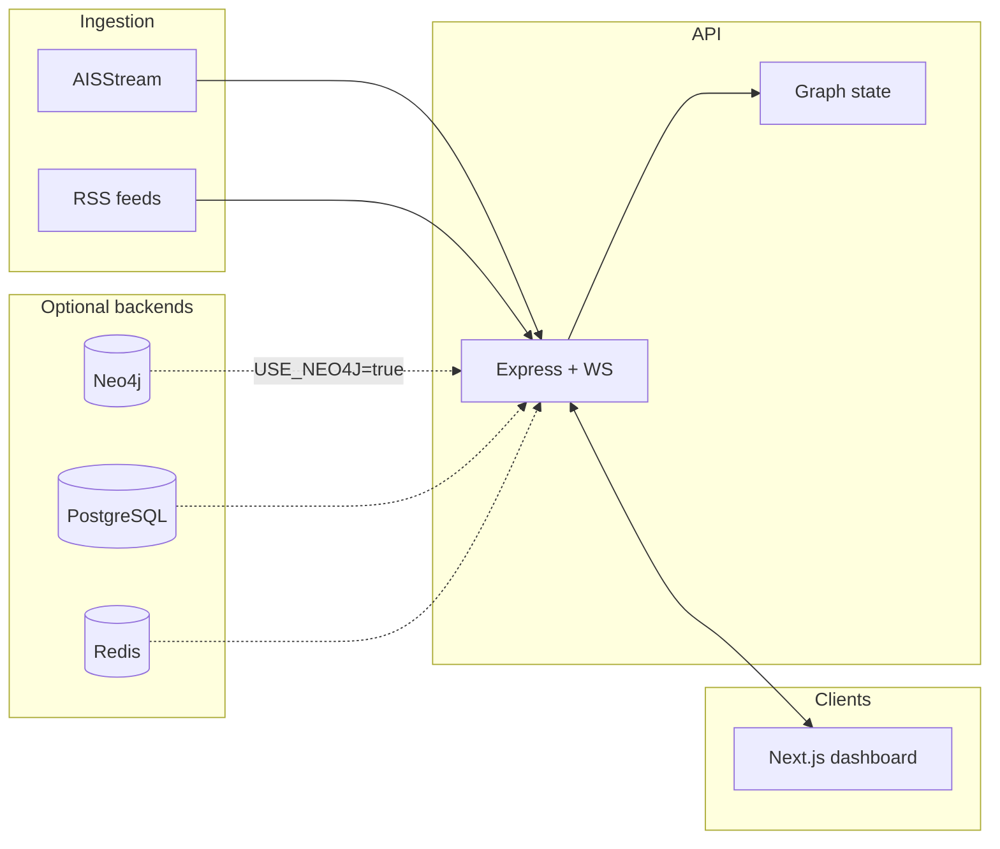

# SupplyChain Guard AI

Real-time maritime intelligence and graph-based supply chain disruption mitigation. The platform ingests AIS vessel data and news, classifies disruptions, propagates risk over a supply network, and suggests reroutes with LLM-backed reasoning.

---

## How it works

### End-to-end flow

1. **Graph state** — On startup, the API loads the supply network. With `USE_NEO4J=true` it reads nodes and `SHIPS_TO` edges from Neo4j; otherwise it loads `data/seed/graph-seed.json` (same data is mirrored under `client/public/graph-seed.json` for client-side fallback when the API is unavailable).

2. **Dashboard** — The Next.js app fetches `/api/graph` for nodes and edges, renders them on a D3 map (`SupplyMap`), and subscribes to `WebSocket` updates for live risk changes.

3. **Disruptions** — Events can come from:
   - **Manual simulation** — `POST /api/simulate` with a target node (and optional origin/destination for route-scoped scenarios).
   - **AIS worker** — Live vessel patterns near monitored zones can raise congestion-style events.
   - **RSS + NLP** — News is classified (e.g. port delay, weather); high-confidence items can attach to graph nodes.

4. **Risk propagation** — When a node is disrupted, risk spreads along edges. If Neo4j is enabled, propagation uses Cypher-based traversal (`propagateRiskNeo4j`); otherwise an in-memory BFS-style walk over `graphEdges` (`propagateRisk`). Updated scores are pushed to connected clients over the WebSocket.

5. **Rerouting** — After a disruption, **Gemini** (with **Groq** fallback) proposes alternative legs using graph context. The UI can highlight recommended paths.

### Network topology (five node types)

The map and API treat the graph as five labeled kinds (Neo4j labels are capitalized the same way):

| Type        | Role (illustrative)                          |
| ----------- | --------------------------------------------- |
| `port`      | Sea hubs, chokepoints, major container ports |
| `factory`   | Assembly and manufacturing sites               |
| `warehouse` | 3PL / distribution centers                     |
| `supplier`  | Materials and tier-1 inputs                    |
| `carrier`   | Ocean and air logistics operators              |

Edges are stored as **`SHIPS_TO`** relationships with `weight`, `lead_time`, `mode`, and `volume`-style metadata for visualization and propagation tuning.

### Repository layout (high level)

| Path | Purpose |
| ---- | ------- |
| `client/` | Next.js App Router UI, D3 map, WebSocket client |
| `server/` | Express API, WebSocket server, AIS/RSS workers, graph init |
| `data/seed/` | Canonical graph seed + generator script |
| `ml/` | FastAPI + DistilBERT for news classification |

---

## Vision

Global volatility makes supply visibility essential. SupplyChain Guard AI turns AIS streams and RSS feeds into structured events, scores downstream exposure on a graph, and surfaces reroute options quickly after an incident.

---

## Key features

### Maritime intelligence (AIS)

- Live vessel tracking via **AISStream.io** (optional; disable with `AISSTREAM_ENABLED=false`).
- Congestion-style signals near defined port zones.

### NLP news pipeline

- RSS polling and **DistilBERT**-style classification into disruption categories.
- Severity and location extraction for graph correlation.

### Graph-based risk

- **Neo4j** (optional): risk propagation and full graph reads when `USE_NEO4J=true`.
- **File-backed graph**: same JSON seed when Neo4j is off or empty.
- Node **centrality** and edge weights inform layout and propagation strength.

### AI rerouting

- **Gemini 2.0 / Groq** for natural-language reroute recommendations grounded in graph structure.

---

## Architecture



---

## Tech stack

- **Frontend**: Next.js (App Router), TypeScript, D3.js, Zustand.
- **Server**: Node.js (Express), `ws`, node-cron.
- **Graph DB**: Neo4j (Aura or self-hosted).
- **ML**: Python (FastAPI), Hugging Face Transformers, DistilBERT.
- **Other**: Redis, PostgreSQL (as wired in your deployment), Docker Compose.

---

## Getting started

### Prerequisites

- **Node.js** 18+
- **Python** 3.10+ (for the ML service)
- **API keys** (see `.env.example`): AISStream, Gemini, Groq; Neo4j if you use the cloud DB.

### Environment

Copy `.env.example` to `.env` at the **repository root** (the server loads this path). Configure at least:

- `NEWSAPI_KEY`, `GEMINI_API_KEY`, `GROQ_API_KEY` as needed
- `AISSTREAM_API_KEY` if AIS is enabled
- `NEO4J_URI`, `NEO4J_USER`, `NEO4J_PASSWORD` if you use Neo4j

Graph-related variables:

- **`USE_NEO4J`** — Set to `true` to read the live graph from Neo4j after you have hydrated it; leave `false` to use the JSON seed only.
- **`NEO4J_CLEAR`** — Used only by the hydrate script: when `true`, wipes all nodes and relationships before loading the seed (recommended when the graph shape changes).

### Run locally

**ML service** (optional for full NLP features):

```bash
cd ml && pip install -r requirements.txt
uvicorn api:app --port 8000
```

**API server** (from `server/`):

```bash
cd server && npm install
npm run dev
```

**Client** (from `client/`):

```bash
cd client && npm install
npm run dev
```

Default URLs are typically API `http://localhost:3001`, client `http://localhost:3000` — align `NEXT_PUBLIC_API_URL` and `NEXT_PUBLIC_WS_URL` with your API port.

### Docker

```bash
docker-compose up --build
```

Open the dashboard at `http://localhost:3000` (or the port mapped in Compose).

---

## Graph seed and Neo4j

### Canonical data

- **`data/seed/graph-seed.json`** — Source of truth for the demo network (on the order of **~136 nodes** and **~282 edges**; counts may change when you regenerate).
- **`client/public/graph-seed.json`** — Copy kept in sync for offline / no-API fallback in the browser.

### Regenerating the graph

Edit **`data/seed/generate-graph-seed.mjs`** (curated lists + edge rules), then:

```bash
node data/seed/generate-graph-seed.mjs
```

Copy the output to the client if you changed the canonical file:

```bash
# example (adjust for your shell)
cp data/seed/graph-seed.json client/public/graph-seed.json
```

### Seeding Neo4j

From **`server/`**, with Neo4j running and credentials in root `.env`:

```bash
# Full reload (recommended after changing seed shape)
set NEO4J_CLEAR=true
npm run neo4j:hydrate
```

On Unix:

```bash
NEO4J_CLEAR=true npm run neo4j:hydrate
```

This runs `scripts/hydrateNeo4j.js`, which `MERGE`s nodes and `SHIPS_TO` relationships from `data/seed/graph-seed.json`.

Then set **`USE_NEO4J=true`**, restart the API, or call **`POST /api/graph/refresh`** if your deployment supports it so in-memory graph state matches the database.

---

## Simulation (manual test)

1. Open the **Simulate** controls in the dashboard.
2. Choose a target node (e.g. a major port).
3. Trigger a disruption and watch the map and risk panel.
4. Inspect LLM reroute suggestions when configured.

---

## Handling large files (Git LFS)

The DistilBERT weights exceed normal GitHub file limits. Install [Git LFS](https://git-lfs.com/), run `git lfs install` and `git lfs pull` after clone so `*.safetensors` and similar assets resolve to real files.

Model path: `ml/models/distilbert-disruption-v1/`.

---

## License

Distributed under the MIT License. See `LICENSE`.

---

Built by the SupplyGuard team.
