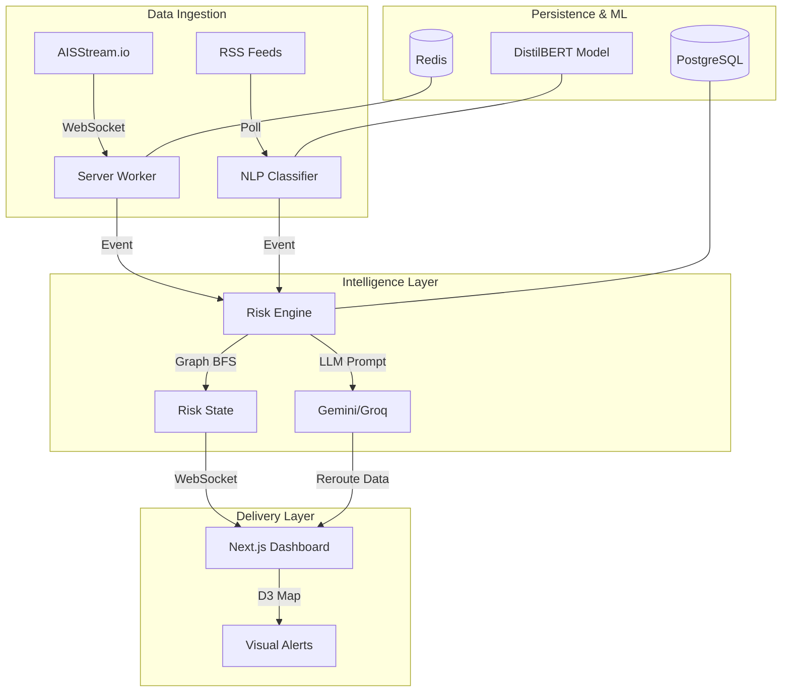

# 🛡️ SupplyChain Guard AI

**Real-time maritime intelligence and automated supply chain disruption mitigation.**

SupplyChain Guard AI is a high-performance, predictive platform designed to detect, classify, and mitigate global supply chain disruptions using live maritime data, NLP-driven news ingestion, and graph-based risk propagation.

---

## 🚀 Vision
In an era of global volatility, supply chain visibility is no longer optional. SupplyChain Guard AI transforms raw AIS (vessel) data and global RSS news feeds into actionable intelligence. When a port congests or a supplier fails, the system automatically calculates the downstream impact and recommends optimal rerouting paths—seconds after the event occurs.

---

## ✨ Key Features

### 📡 Real-time Maritime Intelligence (AIS)
- Live vessel tracking via **AISStream.io**.
- Automated congestion detection at 12 critical global port zones (Singapore, Rotterdam, Shanghai, LA, etc.).
- High-precision bounding boxes and speed-based delay classification.

### 📰 NLP News Ingestion Pipeline
- Automated polling of global news sources (BBC, Reuters, Google News).
- **DistilBERT-powered classification**: Categorizes news into `port_delay`, `weather_event`, `supplier_failure`, or `geopolitical`.
- Automated extraction of severity and affected locations.

### 📊 Graph-based Risk Propagation
- Real-time BFS (Breadth-First Search) propagation through a multi-tier supply chain graph.
- Calculates cascading risk scores for upstream suppliers and downstream manufacturing hubs.
- **Centrality-based layout**: Nodes with higher supply chain criticalness are visually prioritized.

### 🛣️ AI-Driven Rerouting
- **Gemini 2.0 / Groq Fallback**: Large Language Models analyze disruptions and recommend alternative logistical paths.
- **Route Tracing**: Visual green-path animation for recommended alternatives.

---

## 🏗️ Architecture



---

## 🛠 Tech Stack

- **Frontend**: Next.js (App Router), TypeScript, D3.js (Simulation), Zustand (State), CSS-Mocks.
- **Server**: Node.js (Express), WebSocket (ws), node-cron.
- **ML Service**: Python (FastAPI), HuggingFace Transformers, DistilBERT, NetworkX.
- **Storage**: Redis (Real-time state), PostgreSQL (Deep analytics).
- **Orchestration**: Docker Compose.

---

## 🚦 Getting Started

### 1. Prerequisites
- **Node.js**: v18+ 
- **Python**: v3.10+
- **API Keys**:
  - `AISSTREAM_API_KEY`: Get from [aisstream.io](https://aisstream.io)
  - `GEMINI_API_KEY`: Google AI Studio
  - `GROQ_API_KEY`: Groq Console (for Llama fallback)

### 2. Environment Setup
Create a `.env` file in the root based on `.env.example`:
```bash
AISSTREAM_API_KEY=your_key
GEMINI_API_KEY=your_key
GROQ_API_KEY=your_key
```

### 3. Running with Docker (Recommended)
Launch the entire 5-service stack with one command:
```bash
docker-compose up --build
```
Access the dashboard at `http://localhost:3000`.

### 4. Running Locally (Development)
**ML Service**:
```bash
cd ml && pip install -r requirements.txt
uvicorn api:app --port 8000
```

**Server**:
```bash
cd server && npm install
npm run dev
```

**Client**:
```bash
cd client && npm install
npm run dev
```

---

## 📦 Git LFS & ML Models
This repository uses **Git LFS (Large File Storage)** to handle the 255MB DistilBERT model weights (`model.safetensors`).
- If you clone the repo, run `git lfs pull` to ensure models are downloaded.
- The model is stored in `ml/models/distilbert-disruption-v1/`.

---

## 🧪 Simulation
Trigger a manual disruption to test the platform:
1. Navigate to the **Simulate** tab.
2. Select a target node (e.g., **Port of Shanghai**).
3. Click "Trigger Disruption".
4. Watch the **D3 Map** for red ripples and follow the **Recommended Green Routes**.

---

## 📜 License
Distributed under the MIT License. See `LICENSE` for more information.

---

**Built with 🛡️ by SupplyGuard Core Team.**
